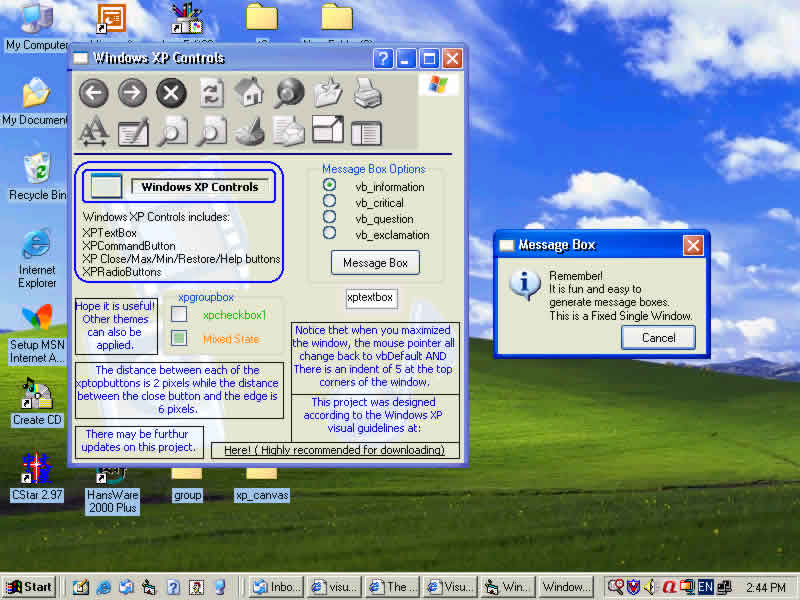



## WINDOWS XP CONTROLS created in VB6

### Description

This is the creation of Windows XP Controls in Visual Basic 6! This is REAL created Windows XP. LOOK AT SCREEN SHOT! Basically, Windows XP is made up of graphics and it has a very complicated User Interface. This project has been designed according to the Windows XP Guidelines. Additional resources have been provided. Please VOTE!
 
### More Info
 

             |
---                |---
**Submitted On**   |2001-12-05 01:15:04
**By**             |[Ming Han](https://github.com/Planet-Source-Code/PSCIndex/blob/master/ByAuthor/ming-han.md)
**Level**          |Intermediate
**User Rating**    |4.7 (393 globes from 84 users)
**Compatibility**  |VB 6\.0
**Category**       |[Complete Applications](https://github.com/Planet-Source-Code/PSCIndex/blob/master/ByCategory/complete-applications__1-27.md)
**World**          |[Visual Basic](https://github.com/Planet-Source-Code/PSCIndex/blob/master/ByWorld/visual-basic.md)
**Archive File**   |[WINDOWS\_XP393951242001\.zip](https://github.com/Planet-Source-Code/ming-han-windows-xp-controls-created-in-vb6__1-28804/archive/master.zip)

